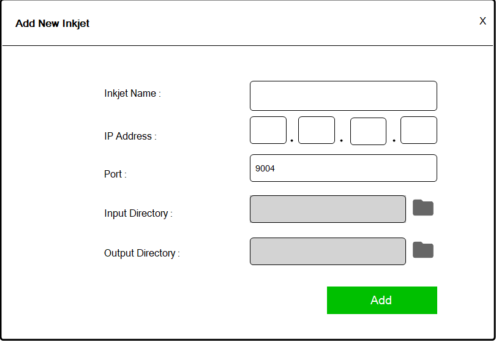

# 🚀 โปรแกรมจัดการเครื่องพิมพ์ Inkjet Keyence


## 📖 คำอธิบาย
โปรเจคต์นี้เป็นระบบสําหรับควบคุมเครื่องพิมพ์ Inkjet Keyence รุ่น MK-G1000 Series เพื่อไว้จัดการในส่วนต่างๆ เช่น ส่งข้อความ บันทึกประวัติในการพิมพ์ และแสดงสถานะล่าสุดของ Inkjet เป็นต้น 
โดยระบบออกแบบมาให้ผู้ใช้งานสามารถควบคุมผ่านคอมพิวเตอร์หรือโน๊ตบุ้คได้ทุกรุ่น โดยสามารถเชื่อมต่อ Inkjet พร้อมกันได้สูงสุดถึง 4 เครื่อง ผ่านการเชื่อมต่อด้วย IPAddress

---

## 📸 ตัวอย่างหน้าจอ (Screenshots)

ภาพรวมการทำงานของระบบ:

  
*รูปที่ 1: หน้า Dashboard แสดงข้อมูล Inkjet ทั้งหมด*

  
*รูปที่ 2: ฟอร์มเพิ่ม Inkjet ใหม่*

---

## ⚙️ วิธีการติดตั้ง

1. Clone โปรเจกต์นี้ลงเครื่องของคุณ:
   ```bash 
   git clone https://github.com/ecctechs/KEYENCE_inkjet_printing_control_DEMO.git
   cd KEYENCE_inkjet_printing_control_DEMO


# 🖥️ วิธีใช้งานโปรแกรม Inkjet

## 1. เชื่อมต่อเครื่อง Inkjet กับคอมพิวเตอร์
- ต่อสาย LAN จากคอมพิวเตอร์หรือโน้ตบุ๊กไปยังเครื่อง Inkjet
- หากควบคุมหลายเครื่อง ให้เชื่อมแต่ละเครื่องเข้ากับ Hub/Switch

## 2. ทดสอบการเชื่อมต่อ
- เปิด CMD แล้วใช้คำสั่ง `PING` หา IP ของแต่ละเครื่อง Inkjet
- หาก PING ตอบกลับ แสดงว่าเชื่อมต่อสำเร็จ

## 3. เปิดโปรแกรม Inkjet

## 4. ตั้งค่าไฟล์สถานะแบบ Real-Time
- คลิกปุ่ม **Browse Output Status Path**
- เลือกไฟล์ `live_status.csv` เพื่อดูสถานะเครื่องพิมพ์แบบเรียลไทม์

## 5. เพิ่มเครื่อง Inkjet
- กด **สร้าง INKJET** และกรอกข้อมูลดังนี้:
  - Inkjet Name
  - IPAddress
  - Port
  - Input Directory
  - Output Directory
- **หมายเหตุ:** ตรวจสอบว่า Status Inkjet ไม่ใช่ Disconnect ก่อนดำเนินการขั้นตอนต่อไป

## 6. ส่งไฟล์ข้อความสำหรับพิมพ์
- ลากไฟล์ `.txt` เข้าไปใน **Input Directory**
- ไฟล์ `.txt` ต้องมีข้อความภายใน เช่น `BATCH-ABC`

## 7. ตรวจสอบคิวงานพิมพ์
- หลังลากไฟล์เข้ามา:
  - **Queue Data** = ชื่อไฟล์
  - **Waiting Print Detail** = ข้อความภายในไฟล์

## 8. ระบบการพิมพ์อัตโนมัติ
- โปรแกรมจะตรวจสอบทุก 10 วินาที
- หากเครื่องอยู่ในสถานะพร้อมพิมพ์:
  - ข้อมูลจะย้ายจาก **Queue Data → Current Data**
  - ข้อความย้ายจาก **Waiting Print Detail → Lastest Print Detail**
  - ไฟล์ใน **Input Directory** จะถูกลบทันที

## 9. ตรวจสอบประวัติข้อความ
- ข้อความที่ส่งพิมพ์แล้วสามารถดูได้ใน **Output Directory**


## ⚙️ โหมดการทำงาน (Auto / Manual)

1. โหมด Auto
- โปรแกรมจะ ตรวจสอบ Queue และสถานะเครื่อง Inkjet โดยอัตโนมัติ ทุก ๆ 10 วินาที  
- เมื่อเครื่องพร้อมพิมพ์ (ไม่มี Error) ข้อมูลจะถูกส่งไปที่ Inkjet โดยอัตโนมัติ
- ไฟล์ใน Input Directory จะถูกลบทันทีหลังส่งสำเร็จ และบันทึกในประวัติการพิมพ์ว่า Auto
- เหมาะสำหรับการส่งไฟล์หลาย ๆ ชุดต่อเนื่องโดยไม่ต้องควบคุมเอง

2. โหมด Manual
- ผู้ใช้สามารถกดคลิกที่ปุ่ม ดินสอ เพื่อพิมพ์ข้อความลงในช่อง Latest Print Detail และส่งไปที่ Inkjet ด้วยตนเอง  
- เมื่อเครื่องพร้อมพิมพ์ (ไม่มี Error) ข้อมูลจะถูกส่งไปที่ Inkjet  
- ไฟล์ใน Input Directory จะถูกลบทันทีหลังส่งสำเร็จ และบันทึกในประวัติการพิมพ์ว่า Manual 
- เหมาะสำหรับการส่งข้อความเดียว เพื่อส่งให้ Inkjet ทันที

## 🖥️ เครื่องมือที่ใช้ในการพัฒนา

1. ระบบปฏิบัติการ Windows 10
2. Microsoft Visual Studio 2022
 - Guna.UI2.WinForms 2.0.4.7
 - Newtonsoft.Json 13.0.3
 - .NET Framework 4.7.2
